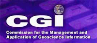

  

A read-only web delivery system for Simple Knowledge Organization System (SKOS)-formulated RDF vocabularies.

# Introduction
VocPrez is used by:

* [Geological Survey of Queensland](https://www.business.qld.gov.au/industries/mining-energy-water/resources/geoscience-information/gsq)
    * System link: <https://vocabs.gsq.digital> 

* [Geoscience Australia](https://www.ga.gov.au)
    * System link (demo): <http://ga.surroundaustralia.com> 
    

* [Commission for the Management and Application of Geoscience Information (CGI)](http://www.cgi-iugs.org/)
    * System link: <http://cgi.vocabs.ga.gov.au/>    
     
# Documentation     
     
See the Documentation at https://RDFLib.github.io/VocPrez/

# Contacts
*Author*:  
**Nicholas Car**  
*Data Systems Architect*  
[SURROUND Australia Pty Ltd](http://surroundaustralia.com)  
<nicholas.car@surroundaustralia.com>
