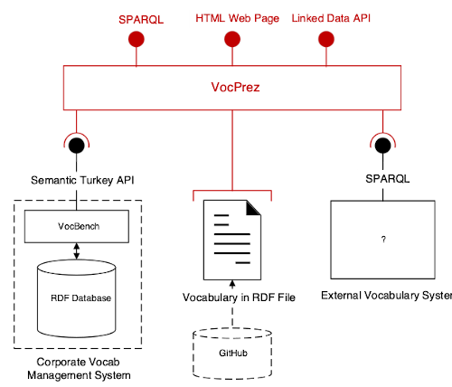

# VocPrez

 

A read-only web interface for Simple Knowledge Organization System (SKOS)-formulated RDF vocabularies.

# Introduction 

VocPrez is a pure Python application that reads vocabularies from one or more sources and presents them online (HTTP) in several different ways: 

* as human-readable web pages
    * using simple HTML templates for different SKOS objects
* as machine-readable RDF or other formats
    * using mapping code
    
The different information model views VocPrez supports are defined by *profiles*, that is by formal specifications. VocPrez supports both different profiles and different formats (Media Types) for each profile. 

VocPrez is used by:

 

* [Geological Survey of Queensland](https://www.business.qld.gov.au/industries/mining-energy-water/resources/geoscience-information/gsq)
    * System link: <https://vocabs.gsq.digital> 

 

* [Geoscience Australia](https://www.ga.gov.au)
    * System link (demo): <http://ga.surroundaustralia.com> 
    
 

* [Commission for the Management and Application of Geosceicne Information (CGI)](http://www.cgi-iugs.org/)
    * System link: <http://cgi.vocabs.ga.gov.au/>
    

 

* [British Geological Survey (BGS)](https://bgs.ac.uk/)
    * System link: <https://devdata.bgs.ac.uk/vocprez/> - *dev only!*
    

## VocPrez structure

  
**Figure 1**: An overview diagram of where VocPrez fits in relation to sources of vocab data.

Common back-ends are RDF databases (triplestores), files, vocabulary APIs, GitHub. Adapters exist for all of these.

Beneath the hood, VocPrez is a SKOS-specific implementation of the [pyLDAPI](https://github.com/rdflib/pyLDAPI). pyLDAPI is a generic tool for the deliver of [RDF](https://www.w3.org/RDF/) data online in both human- and machine-readable formats; it turns RDF data into *[Linked Data](https://www.w3.org/standards/semanticweb/data)*. 

## SKOS

pyLDAPI needs deployment-specific templates for registers & classes that present the data of interest in that deployment. VocPrez is pre-configured with templates for SKOS' core data classes - `ConceptScheme`, `Collection` & `Concept` - and registers of them. It also assumes that a `ConceptScheme` is synonymous with a *Vocabulary*.

This tool is *not* a SKOS data editor! It is expected to be used with a SKOS data source (any sort of datasource can be configured and three come pre-loaded) and its only role is to publish that SKOS data online as Linked Data.

The design goal for this tool was to provide an easily configurable template-based SKOS presenter since many of the other SKOS editing and presentation tools, available as of November 2018, are pretty complex instruments and make life difficult for normal web development tasks such as institutional branding of vocabulary data.

Since this tool is preconfigured for SKOS data, it is ready for use with SKOS-only vocabularies. Forks of this codebase can be made to enhance it for SKOS+ features. SKOS+ is a general term for SKOS data *plus some other bits*.


## API & Templates

As per other pyLDAPI deployments, this tool uses the [Jinja2 Python templating engine](http://jinja.pocoo.org/) to generate HTML and other files which are called for use through Python's [Flask](http://flask.pocoo.org/), a small HTTP framework.

Standard templates for `ConceptScheme`, `Collection`, `Concept` & `Container` (general lists) are contained within this repository, as is a Model-View-Controller-style deployment of Flask, pre-configures for SKOS.

Supplying information to those templates are *model* (Python class) files for `ConceptScheme` etc. that read from the data source and store data according to VocPrez' internal data model.

# Installation

There are a number of ways to install VocPrez. These all involve at least two and sometimes three major steps.

Minimally:

1. Install VocPrez like a normal Python Flask application
    * See [Flask's installation documentation](https://flask.palletsprojects.com/en/1.1.x/installation/)
2. Configure a data *Source* and VocPrez instance details
    * One of the source files in `source/` needs to be adapted to point to your source(s) of vocabulary data
    * particular endpoints, passwords, environment variables etc. need to be set in `config/`
        * there is a demo config file in `config/`: `template.py`. Try adapting that
        * rename your adapted config file `__init__.py` still within `config/` so VocPrez sees it as a config module 

    Additionally:

3. Style it
    * a number of organisations deploying VocPrez override the (boring) templates with their own and add some additional API endpoints for various functions. 
    * see the instructions for Geoscience Australia's instance:
        * <https://github.com/geoscienceaustralia/VocPrez-theme-ga>
        
A minimal set of BASH command for installing VocPrez, and applying styling from an additional repo, on an AWS-hosted Ubuntu Linux server are:

```shell script
# setup
sudo apt -y update
export VP_HOME=/var/www/vocprez
export VP_THEME_HOME=/home/ubuntu/my-theme


# get VocPrez
sudo mkdir $VP_HOME
sudo chown ubuntu $VP_HOME
git clone https://github.com/RDFLib/VocPrez/ $VP_HOME


# Python virtual environment
sudo apt install -y python3-venv
python3 -m venv $VP_HOME/venv
source $VP_HOME/venv/bin/activate
pip install -r $VP_HOME/requirements.txt
# optional, if deploying with GUnicorn, not Apache as per below
pip install -r $VP_HOME/requirements.depploy.txt  


# configure VocPrez
# _config
cp config.py $VP_HOME/vocprez/_config/__init__.py


# get the GA VP theme
git clone https://github.com/me/my-vp-theme $VP_THEME_HOME
# apply the theme
sh $VP_THEME_HOME/apply.sh


# Apache
sudo apt install -y apache2
# config
sudo cp apache.conf /etc/apache2/sites-available/000-default.conf
sudo apt install -y libapache2-mod-wsgi-py3
sudo chown -R www-data $VP_HOME/vocprez/cache  # Apache needs to own the cache folder to be able to write to it
sudo service apache2 restart
```

A standard Apache configuration, referred to above as apache.conf, for a Flask app like VocPrez is:

```shell script
<VirtualHost *:80>
        ServerAdmin someone@somewhere.com
        DocumentRoot /var/www/html

        ErrorLog ${APACHE_LOG_DIR}/error.log
        CustomLog ${APACHE_LOG_DIR}/access.log combined

        WSGIDaemonProcess xxx user=www-data python-home=/var/www/vocprez/venv processes=2 threads=6
        WSGIScriptAlias / /var/www/vocprez/app.wsgi
        <Directory /var/www/vocprez/>
                WSGIProcessGroup xxx
                WSGIApplicationGroup %{GLOBAL}
                Require all granted
        </Directory>
</VirtualHost>
```

## Data Sources

VocPrez is designed to be able to read vocabulary information from a number of sources. Currently, the following sources have been configured:

* [Research Vocabularies Australia](http://vocabs.ands.org.au) (RVA)
* [VocBench3](http://vocbench.uniroma2.it/)
* generic SPARQL endpoint
* local RDF files
* GitHub

VocPrez generates a cached index of vocabularies you want it to display. It gets the vocab information from a `VOCAB_SOURCES variable` in the [_config/__init__.py](config/) file you need to set up. An example list of two sources, RVA & SPRAQL are given in the [template config file](_config/template.py), also copied below.

```
VOCAB_SOURCES = {
    # an example of a SPARQL endpoint - here supplied by an instance of GrpahDB
    "ga": {
        "source": VocabSource.SPARQL,
        "sparql_endpoint": "http://a-sparql-endpoint.com/endpoint",
        "sparql_username": "xxx",
        "sparql_password": "yyy"
    },
    # an example of querying the ARDC RVA vocab system (https://vocabs.ands.org.au)
    'rva': {
        'source': VocabSource.RVA,
        'api_endpoint': 'https://vocabs.ands.org.au/registry/api/resource/vocabularies/{}?includeAccessPoints=true',
        'vocabs': [
            {
                'ardc_id': 50,
                'uri': 'http://resource.geosciml.org/classifierscheme/cgi/2016.01/geologicunittype',
            },
            {
                'ardc_id': 52,
                'uri': 'http://resource.geosciml.org/classifierscheme/cgi/2016.01/contacttype',
            },
            {
                'ardc_id': 57,
                'uri': 'http://resource.geosciml.org/classifierscheme/cgi/2016.01/stratigraphicrank',
            }
        ]
    }
}
```

Here you see the first source is a SPARQL endpoint. All that's needed here, as specified in the data/source/SPARQL.py file, is a source type ("VocabSource.SPARQL") and a sparql endpoint.

Next is the "RVA" endpoint for which an API endpoint is needed and also a list of vocab IDs and the vocab's URIs. These are neede by data/source/RVA.py to get all the information it needs about vocabularies from RVA.

### New Sources
Additional source files for other vocabulary data sources can be made by creating new `source_*.py` files inheriting from `source.py`. You will need to supply a static `collect()` method that gets all the vocabs and their metadata from the source for the cached vocab index and either make do with or overload the functions in Source.py (such as `get_vocabulary()`) to supply all the other required forms of access to your source's vocabularies.

## Dependencies

See the [requirements.txt](https://github.com/RDFLib/VocPrez/blob/master/requirements.txt) standard Python dependency listing file.


## Releases

See [RELEASE_NOTES.md](RELEASE_NOTES.md) for notes on major releases and plans for future releases.


## License

This code is licensed using the GPL v3 licence. See the [LICENSE file](LICENSE) for the deed.


## Tests

We use [pytest](https://docs.pytest.org/en/latest/) as our testing framework. Tests live in the [tests directory](_tests). These tests ensure that the endpoints are functioning as intended. See the [README.md](_tests/README.md) for the tests for more information.

# Deployment

## Ansible

Coming Soon!

## AWS

Coming soon!

## Docker 

To override the endpoint in the template set the ENDPOINT environment variable. 

### Docker build

First we must build a container from the dockerfile. 

`sudo docker build -t vocprez . -f Dockerfile`

### Docker Run 

To run the container we need to copy the settings from `_config/template.py` to `_config/__init__.py` and set the port. 

 `docker run -it -v $PWD/vocprez/_config/template.py:/vocprez/_config/__init__.py -p 5000:5000 vocprez`

# Contacts
*Author*:  
**Nicholas Car**  
*Data Systems Architect*  
[SURROUND Australia Pty Ltd](http://surroundaustralia.com)  
<nicholas.car@surroundaustralia.com>
